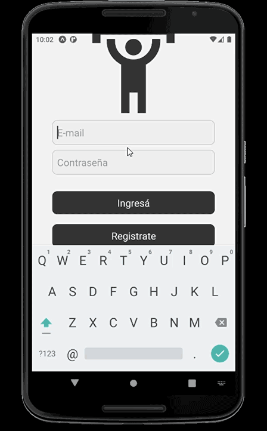

# GymApp Project

## General Description

This is a React Native app to track your progress in the gym. Users will be able to register with an email and password. They will be required to verify email before being able to login with those credentials. Once in the Main Navigation screen, they will be directed by default to their Routine screen, where they will be able to add exercises to their routine, add sets to each exercise and then track history of training in the Trainings screen.

All backend is Google Firebase managed

- Authentication: Firebase Auth
- Database: Firebase Firestore

